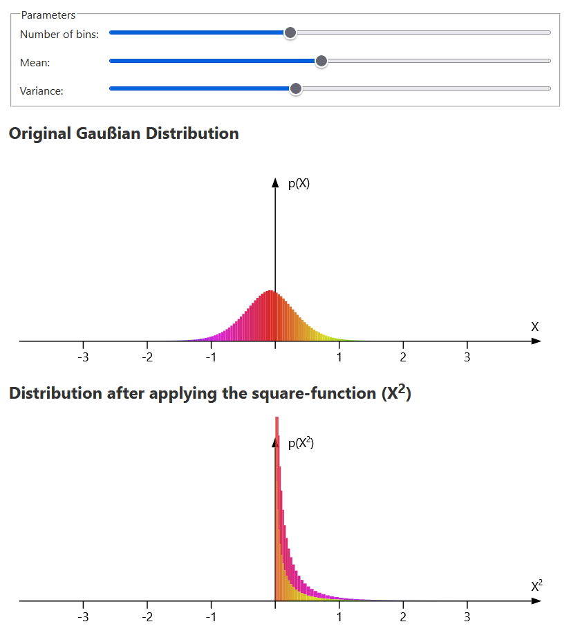

[Live Demo](https://static.laszlokorte.de/random-variable/)

# Function applied to random variables

Applying a function to a random variable affects the resulting distribution. The colored rectangles represent the density of the random variable along the X axis. You can see how squaring the variable shifts all rectangles into the positive range. Each colored rectangles keeps its area but is stretched along the X axis by 2*x (the derivative of x2). Accordingly the height of each rectangle is compressed by 2*x to keep the area constant.

As x^2 is not injective multiple rectangles end up at the same target along the x axis. They simply stack on top of each other to represent the resulting probability density at each location.

Clicking on a single rectangle highlights its corresponding partner rectangle in the other distribution.

Lowering the number of bins makes the individual rectangles more recognizable but reduces the precision of the probability density.